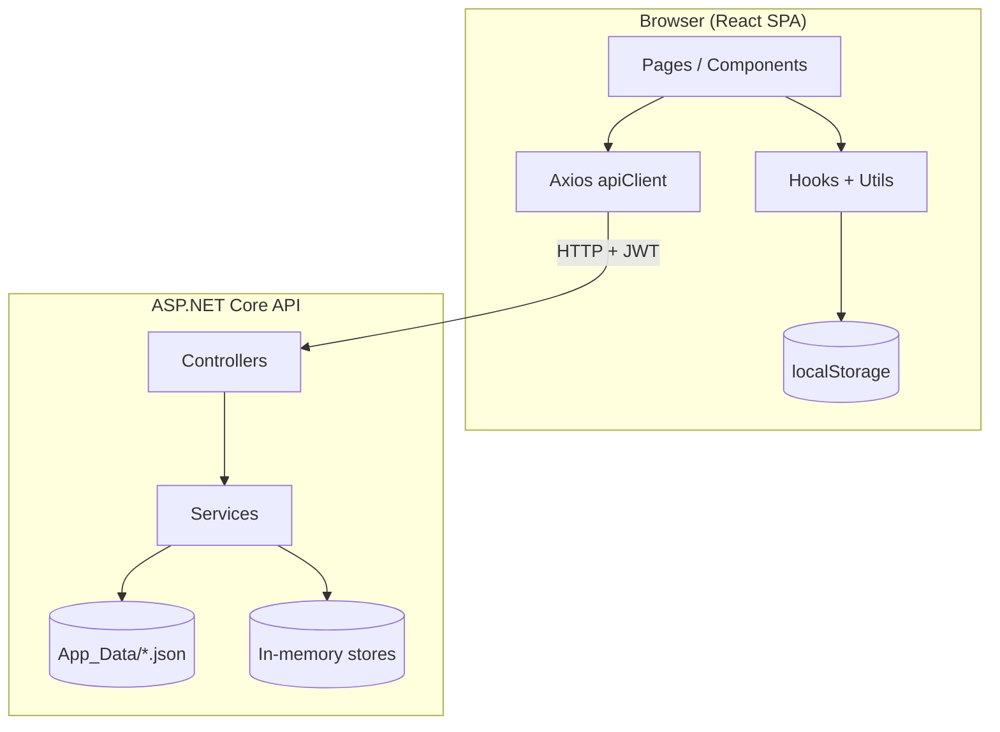
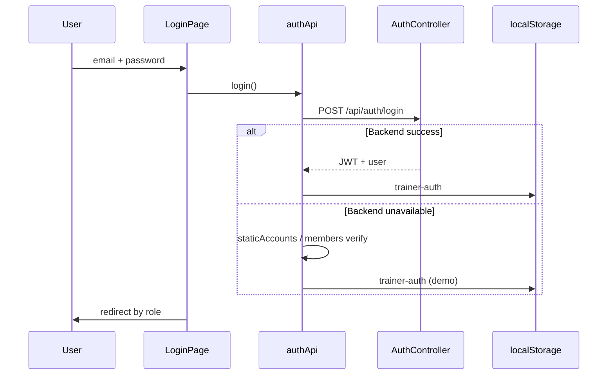
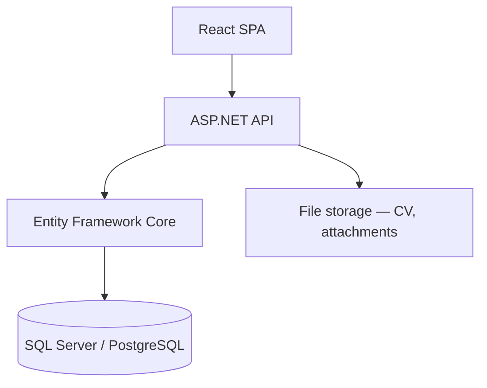

# Architecture — Training Sphere

## 1. High-level diagram



---

## 2. Frontend layers

```
pages/          → Route-level screens
components/     → Reusable UI (admin, company, trainer, student, home)
hooks/          → State synced with localStorage + custom events
utils/          → Pure business logic (enrollment, seats, workspace…)
api/            → HTTP clients; fallback to localStorage when API unavailable
context/        → Auth, Theme, AdminNav
data/           → Static seed data (sessions, admin branches)
```

### App shell routing

`AppShell.jsx` provides:
- Navbar + sidebar per role (trainer / student / admin / company)
- `TrainerWorkspaceSidebar` — trainer training list
- `StudentWorkspaceSidebar` — student navigation

---

## 3. Authentication flow



### Route guards

| Component | Protects |
|-----------|----------|
| `ProtectedRoute` | `/dashboard`, `/student/*`, `/company/*`, `/messages` |
| `AdminProtectedRoute` | `/admin/*` |

---

## 4. Training lifecycle (Company → Admin → Catalog)

```mermaid
flowchart LR
  C[Company creates training request] --> LS1[itconnect_company_training_requests_v1]
  LS1 --> A[Admin reviews]
  A -->|Approve| P[Published to catalog]
  P --> LS2[itconnect_admin_created_trainings_v1]
  LS2 --> S[Student enrolls]
  S --> E[Enrollment application]
  E --> T[Trainer approves]
  T --> W[Student workspace unlocked]
```



---

## 5. Trainer workspace data flow

```
Company assigns trainer (trainerEmail on request)
        ↓
buildTrainerCompanyWorkspace(email)
        ↓
parseCompanyTrainingRequests() — filter by trainerEmail
        ↓
TrainerWorkspaceSidebar.sessions
```

**Not shown:** seed `trainingSections`, track placeholders, or unassigned catalog trainings.

---

## 6. Backend architecture

```
Controllers/     HTTP boundary, authorization attributes
Services/        Business logic
Models/          Request/response DTOs
Student/         Future EF module (entities + contracts)
Filters/         RequireApprovedCourseAccessAttribute
Program.cs       DI registration, CORS, JWT
```

### Persistence today

| Service | Storage |
|---------|---------|
| `EnrollmentApplicationService` | `App_Data/enrollment-applications.json` + CV uploads in `wwwroot/uploads/` |
| `AuthService` | Static in-memory users |
| `MessageService` | In-memory |
| `TaskRepository` / `SubmissionRepository` | In-memory |
| `InternshipService` | In-memory |

### Planned (Student module)

```
Student/
├── Domain/Entities/     StudentAccount, Internship, TaskSubmission…
├── Application/         DTOs, service contracts
├── Api/Controllers/     StudentAuthController (stub)
└── StudentModuleExtensions.cs  → AddDbContext (TODO)
```

---

## 7. Hybrid API + localStorage pattern

Many `frontend/src/api/*.js` files:

1. Try backend with JWT
2. On network/401/5xx → `markPreferLocalPortalData()`
3. Read/write `localStorage` instead

Example: `enrollmentApplicationApi.js` — key `ts-enrollment-applications-v1`

This allows **demo without backend** while keeping the API path for production.

---

## 8. Seat reservation

```
Student clicks Enroll
    → assertCatalogSeatAvailable()
    → increment seatsTaken in catalog snapshot
    → dispatch CATALOG_ENROLLMENT_CHANGED_EVENT
    → AdminDashboard + ServiceTrainingDetailsPage refresh counts
```

---

## 9. Custom events (cross-component sync)

| Event | Emitters | Listeners |
|-------|----------|-----------|
| `admin-created-trainings` | `useAdminCreatedTrainings` | HomeFeatures, ServicesPage |
| `CATALOG_ENROLLMENT_CHANGED_EVENT` | `trainingCatalogEnrollment` | AdminDashboard |
| `registered-members-changed` | `useRegisteredMembers` | AuthContext |
| `storage` | Browser (cross-tab) | Multiple hooks |

---

## 10. Future target architecture



Migration order: **Users → Catalog → Enrollments → Company → Tasks/Messages**

See [DATA_STORAGE.md](./DATA_STORAGE.md), [EVENT_FLOWS.md](./EVENT_FLOWS.md), and [student-module/STUDENT_MODULE.md](./student-module/STUDENT_MODULE.md).
