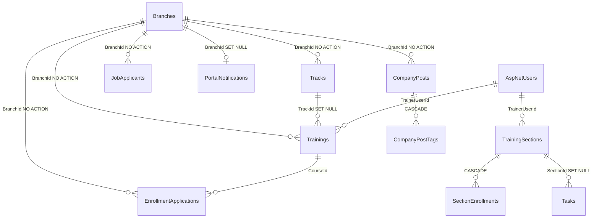

# تقرير تحليل المشروع — Branch، Company، و Multi-Tenant

**التاريخ:** 2026-06-08  
**قاعدة البيانات:** `ITConnectDb_v3` على `DESKTOP-7JAU4ML`  
**نوع الوثيقة:** تحليل فقط — لا تعديلات على كود أو جداول أو migrations

---

## فهرس المحتويات

1. [ملخص تنفيذي](#1-ملخص-تنفيذي)
2. [الجداول في SQL Server](#2-الجداول-في-sql-server)
3. [العلاقات بين الجداول](#3-العلاقات-بين-الجداول)
4. [استخدام Branch في المشروع](#4-استخدام-branch-في-المشروع)
5. [استخدام Company في المشروع](#5-استخدام-company-في-المشروع)
6. [صلاحيات Admin](#6-صلاحيات-admin)
7. [البيانات على مستوى النظام](#7-البيانات-على-مستوى-النظام)
8. [تأثير حذف Branch](#8-تأثير-حذف-branch)
9. [الجداول التي تحتاج إعادة تصميم](#9-الجداول-التي-تحتاج-إعادة-تصميم)
10. [المخاطر المحتملة](#10-المخاطر-المحتملة)
11. [اقتراح هيكل Multi-Tenant](#11-اقتراح-هيكل-multi-tenant)
12. [خريطة الملفات المرجعية](#12-خريطة-الملفات-المرجعية)
13. [الخلاصة](#13-الخلاصة)

---

## 1. ملخص تنفيذي

المشروع يستخدم مفهومين مختلفين:

| المفهوم | المعنى في المشروع | موجود كجدول؟ |
|---------|------------------|--------------|
| **Branch** | تقسيم جغرافي/كتالوج (`cairo`, `alexandria`, `giza`) | نعم — جدول `Branches` |
| **Company** | اسم جهة توظيف (نص) أو دور Identity (`Company`) | **لا** — لا يوجد `CompanyId` ولا جدول `Companies` |

**الخلاصة:** النظام **ليس Multi-Tenant** اليوم. البيانات إما على مستوى **النظام كله** (Members، Auth) أو على مستوى **Branch** (Tracks، Trainings)، أو على مستوى **الشركة بالبريد الإلكتروني** في `localStorage` فقط (Company Dashboard).

---

## 2. الجداول في SQL Server

**العدد الإجمالي:** 33 جدول (+ 10 Views في سكربت v3)

### 2.1 جداول مرجعية (Lookup)

| الجدول | الغرض |
|--------|--------|
| `RefStatuses` | حالات (تدريب، مهمة، طلب تسجيل، …) |
| `RefNotificationTones` | نغمات الإشعارات |
| `RefCourseCategories` | تصنيفات الدورات |
| `RefTags` | وسوم المنشورات |

### 2.2 Identity و Auth

| الجدول | الغرض |
|--------|--------|
| `AspNetRoles` | الأدوار: Admin, Student, Trainer, Company |
| `AspNetUsers` | المستخدمون |
| `AspNetUserRoles` | ربط المستخدمين بالأدوار |
| `AspNetUserClaims` | Claims المستخدمين |
| `AspNetUserLogins` | تسجيلات الدخول الخارجية |
| `AspNetUserTokens` | رموز Identity |
| `AspNetRoleClaims` | Claims الأدوار |
| `RefreshTokens` | JWT refresh tokens |
| `AuditLogs` | سجل التدقيق |

### 2.3 الكتالوج (مرتبط بـ Branch)

| الجدول | الغرض | علاقة بـ Branch |
|--------|--------|-----------------|
| `Branches` | الفروع/المنصات | — |
| `Tracks` | المسارات التدريبية | `BranchId` → `Branches` |
| `Trainings` | البرامج التدريبية | `BranchId` → `Branches` |
| `CompanyPosts` | منشورات الشركات | `BranchId` → `Branches` |
| `CompanyPostTags` | وسوم المنشورات | عبر `CompanyPosts` |
| `JobApplicants` | المتقدمون للوظائف | `BranchId` → `Branches` |

### 2.4 مساحة المدرب والطالب

| الجدول | علاقة بـ Branch |
|--------|-----------------|
| `TrainingSections` | **لا** — حقل `Company` نصي فقط |
| `SectionEnrollments` | غير مباشر عبر `TrainingSections` |
| `Tasks` | غير مباشر عبر `SectionId` |
| `TaskSubmissions` | عبر `Tasks` |
| `EnrollmentApplications` | **`BranchId`** → `Branches` |
| `PortalNotifications` | **`BranchId`** اختياري (SET NULL عند الحذف) |
| `Messages` | غير مباشر عبر المستخدمين والمهام |
| `TrainerFeedback` | غير مباشر عبر المستخدمين والمهام |
| `TraineeEvaluations` | غير مباشر |
| `EvaluationTaskItems` | `RepoBranch` = فرع Git وليس Branch |

### 2.5 التدريب المهني (Internships)

| الجدول | علاقة بـ Branch |
|--------|-----------------|
| `InternshipPrograms` | **لا** — حقل `Company` نصي |
| `InternshipApplications` | عبر `ProgramId` |
| `InternshipApplicationTimelineSteps` | عبر `ApplicationId` |

### 2.6 أخرى

| الجدول | الغرض |
|--------|--------|
| `__EFMigrationsHistory` | سجل EF (Identity فقط — Portal من SQL script) |

### 2.7 Views (في سكربت v3)

- `vw_EnrollmentApplications_Detail`
- `vw_TrackStats`
- `vw_SectionStats`
- `vw_PortalNotifications_Detail`
- `vw_Tasks_Detail`
- `vw_Messages_Detail`
- `vw_TraineeEvaluations_Detail`
- `vw_CompanyPosts_Detail`
- `vw_Trainings_Detail`
- `vw_TrainerFeedback_Detail`

### 2.8 البيانات الحالية (لقطة من SQL)

| الكيان | العدد |
|--------|-------|
| Branches | 3 (`cairo` = Platform, `alexandria`, `giza`) |
| Tracks | 2 |
| Trainings | 6 |
| CompanyPosts | 0 |
| JobApplicants | 3 |
| EnrollmentApplications | 3 |
| PortalNotifications (بها BranchId) | 2 |

---

## 3. العلاقات بين الجداول

### 3.1 Foreign Keys المرتبطة بـ `Branches`

| الجدول | العمود | ON DELETE |
|--------|--------|-----------|
| `Tracks` | `BranchId` | **NO ACTION** |
| `Trainings` | `BranchId` | **NO ACTION** |
| `CompanyPosts` | `BranchId` | **NO ACTION** |
| `JobApplicants` | `BranchId` | **NO ACTION** |
| `EnrollmentApplications` | `BranchId` | **NO ACTION** |
| `PortalNotifications` | `BranchId` | **SET NULL** |

### 3.2 سلسلة التبعية المنطقية

```
Branches
  ├── Tracks
  │     └── Trainings
  │           ├── EnrollmentApplications
  │           └── PortalNotifications (CourseId)
  ├── CompanyPosts
  │     └── CompanyPostTags
  └── JobApplicants

TrainingSections (بدون BranchId)
  ├── SectionEnrollments
  └── Tasks
        ├── TaskSubmissions
        ├── Messages
        └── TrainerFeedback
```

### 3.3 مخطط ER مبسط



---

## 4. استخدام Branch في المشروع

### 4.1 Backend — Entities

**الملف:** `backend/Domain/Entities/Portal/PortalEntities.cs`

| Entity | خاصية Branch |
|--------|--------------|
| `Branch` | `Id`, `Name`, `Region` |
| `Track` | `BranchId` |
| `Training` | `BranchId` |
| `CompanyPost` | `BranchId` |
| `JobApplicant` | `BranchId` |
| `EnrollmentApplication` | `BranchId` |
| `PortalNotification` | `BranchId` |

> **تنبيه:** `EvaluationTaskItem.RepoBranch` = فرع مستودع Git، **ليس** جدول `Branches`.

### 4.2 Backend — DTOs / Models

| الملف | الأنواع |
|-------|---------|
| `backend/Models/CatalogModels.cs` | `BranchDto`, `BranchId` في Track/Training/CompanyPost/JobApplicant |
| `backend/Models/EnrollmentApplicationModels.cs` | `BranchId` في الطلبات والإشعارات |
| `backend/Models/LearningAssistantModels.cs` | `BranchId` في طلبات AI |
| `backend/Services/ICourseAccessAuthorizationService.cs` | `BranchId` في قرارات الوصول |

### 4.3 Backend — Services

| الملف | الوظيفة |
|-------|---------|
| `EfCatalogService.cs` | `ListBranches`, فلترة Tracks/Trainings/Posts/Applicants |
| `EfEnrollmentApplicationService.cs` | التحقق والفلترة بـ `BranchId` |
| `EnrollmentApplicationService.cs` | نفس المنطق (SQLite fallback) |
| `CourseAccessAuthorizationService.cs` | يُرجع `BranchId` في قرار الوصول |

### 4.4 Backend — APIs

| Endpoint | Method | Auth | Branch |
|----------|--------|------|--------|
| `/api/catalog/branches` | GET | عام (AllowAnonymous) | قائمة الفروع |
| `/api/catalog/tracks?branchId=` | GET | عام | فلترة |
| `/api/catalog/tracks` | POST | AdminOnly | `BranchId` في body |
| `/api/catalog/tracks/{id}` | DELETE | AdminOnly | — |
| `/api/catalog/trainings?branchId=` | GET | عام | فلترة |
| `/api/catalog/trainings` | POST | AdminOnly | `BranchId` في body |
| `/api/catalog/trainings/{id}` | DELETE | AdminOnly | — |
| `/api/catalog/company-posts?branchId=` | GET | AdminOnly | فلترة |
| `/api/catalog/company-posts` | POST | AdminOnly | `BranchId` في body |
| `/api/catalog/job-applicants?branchId=` | GET | AdminOnly | فلترة |
| `/api/EnrollmentApplications/*` | متعدد | Student/Trainer | `branchId` query/body |
| `/api/LearningAssistant/chat` | POST | Student | `branchId` |
| `/api/Tasks`, `/Submission`, `/StudentDashboard`, `/Github` | GET/POST | Student | `branchId` + `courseId` |

**لا يوجد:** `DELETE /api/catalog/branches` — لا API لحذف Branch.

### 4.5 Frontend — الملفات الرئيسية

| المنطقة | الملفات | الاستخدام |
|---------|---------|-----------|
| تعريف الفروع | `data/adminDashboardData.js` | `adminBranches`, `normalizeBranchId`, seed data |
| لوحة Admin | `pages/AdminDashboard.jsx` | `?branch=` في URL، فلترة الكتالوج |
| Hooks | `useAdminCreatedTrainings.js`, `useAdminCreatedTracks.js`, `useAdminCompanyPosts.js` | `{ [branchId]: [...] }` |
| Company | `pages/CompanyDashboard.jsx` | `companyBranchId = 'cairo'` ثابت |
| Student | `trainingCatalogEnrollment.js`, `courseAccessRoutes.js` | `(userId, branchId, courseId)` |
| API | `catalogApi.js`, `enrollmentApplicationApi.js` | تمرير `branchId` |
| Public | `ServicesPage.jsx`, `publishedTrainingsCatalog.js` | عرض عبر الفروع |

**فجوة UI:** `setBranchId` موجود في Admin لكن **لا يوجد منتقي فروع**. `adminBranches` يعرض فقط `cairo` رغم وجود 3 فروع في SQL.

### 4.6 localStorage — بيانات مرتبطة بـ Branch

| المفتاح | البنية |
|---------|--------|
| `itconnect_admin_created_trainings_v1` | `{ [branchId]: Training[] }` |
| `itconnect_admin_created_tracks_v1` | `{ [branchId]: Track[] }` |
| `itconnect_admin_created_posts_v1` | `{ [branchId]: Post[] }` |
| `ts-enrollment-applications-v1` | صفوف تحتوي `branchId` |
| `itconnect_company_*_requests_v1` | صفوف تحتوي `branchId` |
| `ts-catalog-training-enrollments-{userId}` | صفوف تحتوي `branchId` |
| `ts-ai-tutor-{userId}-{branchId}-{courseId}` | per-user per-branch per-course |
| `ts-student-active-course` (sessionStorage) | `{ branchId, trainingId }` |

---

## 5. استخدام Company في المشروع

### 5.1 لا يوجد `CompanyId`

الشركة **ليست كياناً** في قاعدة البيانات. لا جدول `Companies` ولا عمود `CompanyId` في أي مكان.

### 5.2 أين تظهر "Company"

| المستوى | الآلية |
|---------|--------|
| **SQL** | `TrainingSections.Company` (نص), `InternshipPrograms.Company` (نص), جدول `CompanyPosts` |
| **Identity** | دور `Company` في `AspNetRoles` |
| **Frontend** | `itconnect_company_profiles_v1`, trainers, requests — مفلترة بـ `companyEmail` |
| **Controllers** | **لا يوجد** `[Authorize(Roles = "Company")]` |

### 5.3 Company Dashboard

- كل الطلبات تُرسل بـ `branchId: 'cairo'` ثابت
- معظم البيانات في `localStorage` وليس SQL
- بعد موافقة Admin تُنشر Trainings/Posts إلى SQL مع `BranchId` فقط (بدون `CompanyId`)

### 5.4 Frontend — ملفات Company

| الملف | الغرض |
|-------|--------|
| `useCompanyProfiles.js` | ملفات الشركات العامة |
| `useCompanyTrainers.js` | مدربو الشركة |
| `useCompanyTrackRequests.js` | طلبات مسارات |
| `useCompanyTrainingRequests.js` | طلبات تدريبات |
| `useCompanyPostRequests.js` | طلبات منشورات |
| `CompanyDashboard.jsx` | لوحة الشركة |
| `companyApplicantsRoster.js` | قائمة المتقدمين |

---

## 6. صلاحيات Admin

### 6.1 Policies (`backend/Program.cs`)

| Policy | الشرط |
|--------|--------|
| `AdminOnly` | `RequireRole("Admin")` |
| `StudentOnly` | `RequireRole("Student")` — **غير مستخدم** في Controllers |

### 6.2 صلاحيات Admin التفصيلية

| Controller / Endpoint | الصلاحية |
|----------------------|----------|
| `GET/POST/DELETE /api/members` | AdminOnly |
| `GET /api/audit` | AdminOnly |
| `POST/DELETE /api/catalog/tracks` | AdminOnly |
| `POST/DELETE /api/catalog/trainings` | AdminOnly |
| `GET/POST/DELETE /api/catalog/company-posts` | AdminOnly |
| `GET /api/catalog/job-applicants` | AdminOnly |
| Section tasks, evaluations | Trainer **أو** Admin |
| `GET /api/catalog/branches` | AllowAnonymous |
| `GET /api/catalog/tracks`, `trainings` | AllowAnonymous |

### 6.3 ما لا يستطيع Admin فعله عبر API

- حذف أو إنشاء Branches
- إدارة Companies ككيان مستقل
- عزل بيانات شركة عن أخرى على مستوى DB

### 6.4 الأدوار الأخرى

| الدور | APIs |
|-------|------|
| Student | EnrollmentApplications, Tasks, Submission, Internships, LearningAssistant |
| Trainer | EnrollmentApplications (review), Section tasks, Evaluations |
| Company | **لا APIs مخصصة** — دور قابل للتعيين فقط |

---

## 7. البيانات على مستوى النظام

بيانات **ليست** معزولة per-company:

| البيانات | التخزين | ملاحظة |
|----------|---------|--------|
| `AspNetUsers` / الأدوار | SQL | نظام كامل |
| Members (Admin UI) | SQL | `/api/members` |
| `AuditLogs`, `RefreshTokens` | SQL | نظام كامل |
| `Branches` | SQL | مشتركة بين الجميع |
| `Tracks`, `Trainings` | SQL + localStorage | حسب `BranchId` فقط |
| `TrainingSections`, `Tasks` | SQL | بدون `CompanyId` |
| `EnrollmentApplications` | SQL + localStorage | `BranchId` + `CourseId` |
| `InternshipPrograms` | SQL | `Company` نص فقط |
| `Evaluations`, `Messages` | SQL | بدون tenant |
| Company profiles, requests | localStorage | بالبريد — غير متزامن مع SQL |
| Admin Members / Companies tabs | API + localStorage | غير مفلترة بـ branch |

---

## 8. تأثير حذف Branch

### 8.1 Hard Delete

**سيفشل** بسبب `ON DELETE NO ACTION` على:

- `Tracks`, `Trainings`, `CompanyPosts`, `JobApplicants`, `EnrollmentApplications`

**يُعالَج تلقائياً:**

- `PortalNotifications.BranchId` → `NULL`

### 8.2 التأثير على Frontend

| المنطقة | التأثير |
|---------|---------|
| Admin Dashboard | كسر `?branch=cairo`، فقدان الكتالوج |
| Company Dashboard | كل الطلبات مربوطة بـ `cairo` |
| Student workspace | سجلات `(branchId, courseId)` يتيمة |
| ServicesPage | روابط `/services/training/cairo/...` تنكسر |
| localStorage | مفاتيح `{ cairo: [...] }` يتيمة |

### 8.3 Soft Delete (`Branches.IsDeleted`)

- السكربت يدعمه لكن **لا API** لتفعيله
- FKs تبقى — البيانات المرتبطة تبقى

---

## 9. الجداول التي تحتاج إعادة تصميم

### 9.1 أولوية عالية

| الجدول | التعديل المقترح |
|--------|-----------------|
| **`Companies` (جديد)** | كيان الشركة: Id, Name, Slug, Plan, IsActive |
| `AspNetUsers` | `TenantId` أو `UserTenants` |
| `Branches` | حذف أو جعله فرعاً داخل الشركة |
| `Tracks`, `Trainings` | `CompanyId` |
| `CompanyPosts`, `JobApplicants` | `CompanyId` |
| `EnrollmentApplications` | `CompanyId` |
| `TrainingSections` | `CompanyId` FK بدل النص |
| `PortalNotifications` | `CompanyId` |
| `InternshipPrograms` | `CompanyId` |

### 9.2 أولوية متوسطة

- `Tasks`, `TaskSubmissions`, `Messages`, `TrainerFeedback`, `TraineeEvaluations`, `AuditLogs`

### 9.3 يمكن الإبقاء global

- `RefStatuses`, `RefTags`, `RefCourseCategories`, `AspNetRoles`

### 9.4 Frontend

- استبدال/تداخل `?branch=` مع `tenantId`
- ربط Company Dashboard بـ SQL
- فلترة Admin per-tenant

---

## 10. المخاطر المحتملة

| # | الخطر | الشدة |
|---|--------|--------|
| 1 | خلط Branch مع Company | عالية |
| 2 | لا CompanyId — استحالة عزل شركتين | عالية |
| 3 | localStorage vs SQL غير متسق | عالية |
| 4 | حذف Branch — FK NO ACTION | عالية |
| 5 | EF migrations لا تشمل Portal | متوسطة |
| 6 | دور Company بدون APIs | متوسطة |
| 7 | Admin يرى كل شيء | عالية |
| 8 | JWT بدون Tenant claim | عالية |
| 9 | cairo = Platform + default لكل Company | متوسطة |
| 10 | Views تفترض Branch | متوسطة |

---

## 11. اقتراح هيكل Multi-Tenant

### 11.1 النموذج: Shared Database, Tenant Column

```
Tenants (Companies)
├── Id, Name, Slug, Domain, IsActive
│
├── UserTenantRoles (UserId, TenantId, Role)
│
├── Catalog (per tenant)
│   ├── Tracks (TenantId)
│   ├── Trainings (TenantId)
│   ├── CompanyPosts (TenantId)
│   └── JobApplicants (TenantId)
│
├── Delivery (per tenant)
│   ├── TrainingSections (TenantId)
│   ├── Tasks / Enrollments
│   └── EnrollmentApplications (TenantId)
│
└── Branches داخل الشركة (اختياري)
    └── Branches (TenantId, Id, Name, Region)
```

### 11.2 تدفق العزل

```
JWT (sub + role + tenant_id)
  → Tenant Resolution Middleware
    → Global Query Filter (TenantId)
      → SQL Server
```

### 11.3 أدوار مقترحة

| الدور | النطاق |
|-------|--------|
| Platform Admin | كل الـ Tenants |
| Company Admin | tenant واحد |
| Trainer | داخل tenant |
| Student | داخل tenant |

### 11.4 خيارات Branch vs Tenant

| الخيار | الوصف |
|--------|--------|
| **أ** | حذف Branch — `TenantId` فقط |
| **ب** | Branch فرع داخل الشركة: `TenantId` + `BranchId` (**موصى به**) |
| **ج** | الإبقاء على الوضع + إضافة Tenant |

### 11.5 خطة انتقال (عند الموافقة — لم تُنفَّذ)

1. إنشاء جدول `Tenants`
2. إضافة `TenantId` للجداول الأساسية
3. Backfill: صفوف `cairo` → tenant افتراضي
4. Middleware + JWT claims
5. EF Global Query Filters
6. نقل Company من localStorage → APIs
7. قرار نهائي: Branch داخلي أو محذوف

---

## 12. خريطة الملفات المرجعية

| الطبقة | المسار |
|--------|--------|
| SQL Schema v3 | `backend/scripts/ITConnect_SQLServer_FullSetup_v3.sql` |
| SQL Schema v2 | `backend/scripts/ITConnect_SQLServer_FullSetup.sql` |
| Changelog | `backend/scripts/SCHEMA_v3_CHANGELOG.md` |
| EF Entities | `backend/Domain/Entities/Portal/PortalEntities.cs` |
| DbContext | `backend/Infrastructure/Persistence/ApplicationDbContext.cs` |
| Portal Config | `backend/Infrastructure/Persistence/PortalModelConfiguration.cs` |
| Catalog Service | `backend/Infrastructure/Persistence/Services/EfCatalogService.cs` |
| Catalog API | `backend/Controllers/CatalogController.cs` |
| Models | `backend/Models/CatalogModels.cs` |
| Enrollment | `backend/Models/EnrollmentApplicationModels.cs` |
| Auth/Admin | `backend/Program.cs`, `MembersController.cs` |
| Frontend Admin | `frontend/src/pages/AdminDashboard.jsx` |
| Branch Data | `frontend/src/data/adminDashboardData.js` |
| Frontend Company | `frontend/src/pages/CompanyDashboard.jsx` |
| Student Context | `frontend/src/utils/trainingCatalogEnrollment.js` |

---

## 13. الخلاصة

| السؤال | الجواب |
|--------|--------|
| هل حذف Branch آمن اليوم؟ | **لا** — FKs تمنع الحذف، والنظام مبني عليه |
| هل Company معزولة؟ | **لا** — لا `CompanyId` |
| ما المطلوب لـ Multi-Tenant؟ | `Tenants`, `TenantId`, JWT, Query Filters, نقل Company إلى SQL |
| هل نُفّذ أي تعديل؟ | **لا** — تحليل وتوثيق فقط |

---

*هذه الوثيقة مُنشأة من تحليل المشروع بتاريخ 2026-06-08. أي تنفيذ يتطلب موافقة صريحة قبل تعديل الكود أو قاعدة البيانات.*
