# Event Flows & User Roles — Training Sphere

This document maps **every event sequence** to the **user role** that performs it — who does what, where in the UI, and what other roles see afterward.

> Architecture: [ARCHITECTURE.md](./ARCHITECTURE.md) · Storage: [DATA_STORAGE.md](./DATA_STORAGE.md)

---

## How the sequence works

Training Sphere runs as a **chain of handoffs** between roles. Each step **unblocks** the next. Nothing skips ahead unless the previous gate is passed.

### Three phases

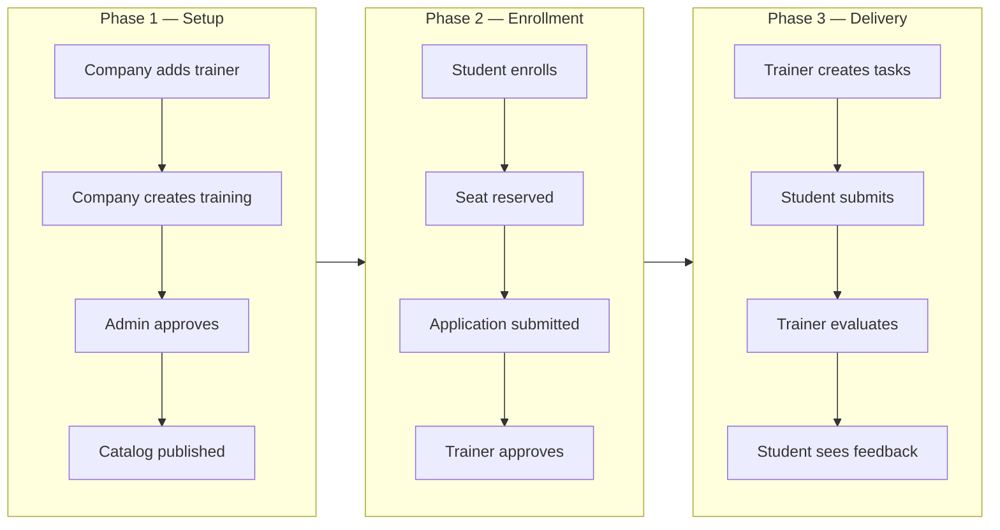

| Phase | Goal | Who drives it | Ends when |
|-------|------|---------------|-----------|
| **1 — Setup** | Training exists in the public catalog with an assigned trainer | Company + Admin | Training visible on `/services` and in trainer sidebar |
| **2 — Enrollment** | Student is accepted into that training | Student + Trainer | Trainer approves application → student workspace opens |
| **3 — Delivery** | Day-to-day learning loop | Trainer + Student | Tasks assigned, submitted, graded (repeats) |

---

### The flow step by step (plain language)

**Phase 1 — Company prepares, Admin publishes**

1. **Company** adds a **trainer** to its roster (name + email + tracks).
2. **Company** creates a **training request** — title, dates, seats, track, and **`trainerEmail`** (who will run it).
3. Request is saved as **`PENDING`**. The **trainer** already sees it in the sidebar as *Pending approval* (not public yet).
4. **Admin** reviews the queue and clicks **Approve**.
5. System **copies** the training into the branch catalog (`admin_created_trainings`) and marks the request **`APPROVED`**.
6. **Now:** training appears on **`/services`**, admin seat stats update, trainer sidebar shows *Active*.

> **Gate:** Student cannot enroll until step 5–6 (catalog live).  
> **Alternate path:** Admin can create a training **directly** (skip company request) — still appears on `/services`, but trainer only sees it if assigned via a company request.

---

**Phase 2 — Student joins, Trainer accepts**

7. **Student** (or guest → login) opens the training on **`/services`** and clicks **Enroll**.
8. System checks **seat availability** → reserves one seat → `seatsTaken` increases.
9. Student is redirected to **`/student/enrollment/application`** → fills form + uploads CV.
10. Application saved as **`pending`**. **Trainer** gets a notification and sees it under **Accept new students**.
11. **Trainer** clicks **Approve** (or Reject with reason).
12. If approved: student **`/student/tasks`** and related pages **unlock**. If rejected: student sees rejection on status page.

> **Gate:** Student workspace stays locked until step 11 (trainer approval).  
> **Gate:** Enroll (step 7) requires a free seat — blocked if full.

---

**Phase 3 — Training runs (repeating loop)**

13. **Trainer** creates a **task brief** on `/dashboard` → assigns it to students in the section workspace.
14. **Student** completes work → submits on **`/student/submit`**.
15. **Trainer** opens **Task Submissions** → grades + writes feedback.
16. **Student** reads feedback on **`/student/feedback`**. Trainer may publish **topics** on `/student/topics`.

> This loop (13 → 16) repeats for each task. It does **not** require Admin or Company again.

---

### Dependency diagram (what blocks what)

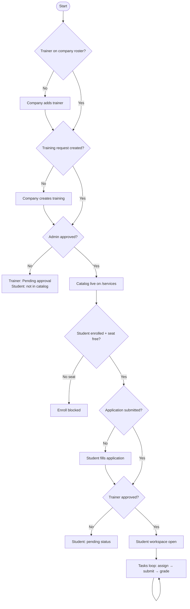

---

### Status changes (what moves the sequence forward)

**Company training request** (`company_training_requests_v1`)

| Status | Meaning | Who can act next |
|--------|---------|------------------|
| `PENDING` | Waiting for admin | Admin → Approve / Reject |
| `APPROVED` | In catalog | Student → Enroll |
| `REJECTED` | Stopped | Company may create a new request |

**Student enrollment application**

| Status | Meaning | Who can act next |
|--------|---------|------------------|
| *(after Enroll, before form)* | Seat reserved, no application yet | Student → Submit application |
| `pending` | Awaiting trainer | Trainer → Approve / Reject |
| `approved` | Accepted | Student → Tasks; Trainer → Assign work |
| `rejected` | Denied | Student sees reason; no workspace |

---

### How the UI updates (without refresh)

When one role completes an action, **custom browser events** notify other screens:

```mermaid
flowchart LR
  Co[Company creates request] --> E1[company-training-requests]
  E1 --> AdUI[Admin queue updates]
  E1 --> TrUI[Trainer sidebar updates]

  Ad[Admin approves] --> E2[admin-created-trainings]
  E2 --> CatUI[/services catalog updates]

  St[Student enrolls] --> E3[ts-catalog-enrollment-changed]
  E3 --> SeatUI[Admin seat count updates]

  St2[Student submits application] --> E4[ts-enrollment-applications-changed]
  E4 --> TrInbox[Trainer inbox updates]

  Tr[Trainer approves] --> E4
  E4 --> StAccess[Student access gates open]
```

---

### One-page cheat sheet

```
SETUP:     Company → (trainer + training request) → Admin approves → Catalog
ENROLL:    Student Enroll → seat++ → Application → Trainer approves
DELIVER:   Trainer task → Student submit → Trainer grade → Student feedback
```

**Quick links:** [Full numbered sequence](#full-sequence--all-roles-together) · [Step table](#who-does-what-at-each-step) · [Per-role details](#index-by-role)

---

## Roles on the platform

| Role | `role` value | After login | Workspace | Owns |
|------|--------------|-------------|-----------|------|
| **Guest** | — | — | `/`, `/services`, `/login` | Browse catalog only |
| **Admin** | `admin` | `/admin` | Admin Dashboard | Branches, tracks, trainings, members, company approvals |
| **Company** | `company` | `/company/dashboard` | Company Dashboard | Company profile, trainers, training/track requests |
| **Trainer** | `trainer` | `/dashboard` | Trainer Workspace | **Company-assigned** trainings, tasks, evaluations, student acceptance |
| **Student** | `student` | `/student/applications` | Student Portal | Enroll, applications, tasks, topics, feedback |

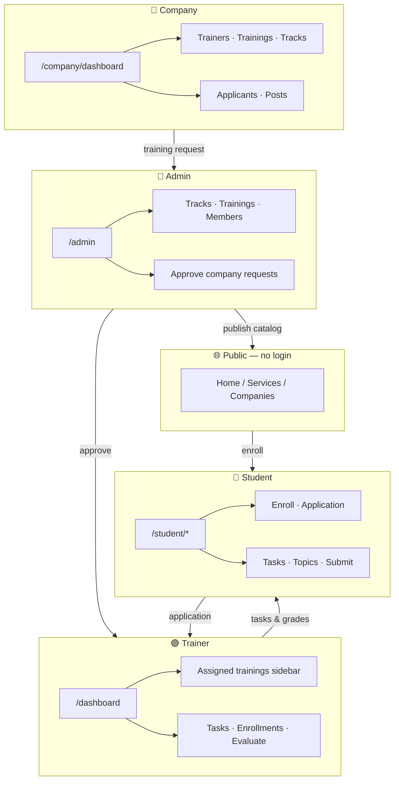

---

## Index by role

### Shared (all roles)
- [How the sequence works](#how-the-sequence-works) — **start here** (phases, gates, status changes)
- [Login & role routing](#1-login--role-routing)
- [Register new member](#2-register-new-member)
- [Full sequence — all roles](#full-sequence--all-roles-together)
- [Who does what at each step](#who-does-what-at-each-step)
- [System custom events](#13-system-custom-events)

### 🔶 Admin
- [Admin publishes training directly](#5-admin-publishes-training-directly)
- [Admin approves company training](#4-company--admin--catalog--trainer)
- [Admin approves company track request](#6-company--admin--custom-track-request)

### 🔷 Company
- [Company adds a trainer](#3-company-adds-a-trainer)
- [Company creates training request](#4-company--admin--catalog--trainer)
- [Company requests custom track](#6-company--admin--custom-track-request)

### 🟣 Trainer
- [Trainer sees assigned trainings](#9-trainer-sees-trainings-in-workspace)
- [Trainer approves enrollment](#8-trainer-approves-enrollment-application)
- [Trainer: tasks → evaluation](#10-trainer-creates-task--student-submits--evaluation)
- [Trainer publishes topics](#11-trainer-publishes-topic-documentation)

### 🔵 Student
- [Student enrolls & submits application](#7-student-enrolls-in-a-training)
- [Student submits task & reads feedback](#10-trainer-creates-task--student-submits--evaluation)
- [Student reads topics](#11-trainer-publishes-topic-documentation)

### Cross-role
- [Messages between roles](#12-messages-between-roles)

---

## Full sequence — all roles together

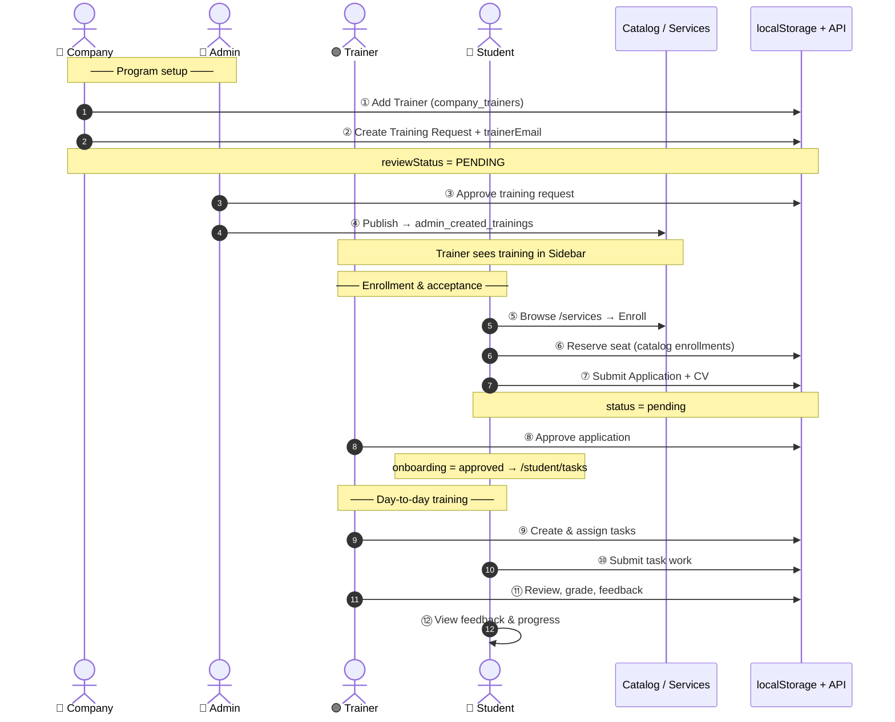

---

## Who does what at each step

| # | Role | Action | Page | What others see |
|---|------|--------|------|-----------------|
| ① | **Company** | Add trainer + tracks | `/company/dashboard` → Trainers | Admin: roster · Trainer: portal account |
| ② | **Company** | Create training request | Trainings → Create | Admin: PENDING · Trainer: Pending approval |
| ③ | **Admin** | Approve training | `/admin` → company requests | Company: APPROVED · Catalog: published |
| ④ | **Admin** | (auto) Publish to catalog | `publishCompanyTraining.js` | **Student**: appears on `/services` |
| ⑤ | **Student** | Browse + Enroll | `/services/training/...` | Admin: seatsTaken++ |
| ⑥ | **Student** | Reserve seat | TrainingEnrollButton | — |
| ⑦ | **Student** | Submit application | `/student/enrollment/application` | **Trainer**: pending inbox |
| ⑧ | **Trainer** | Approve / Reject | `/dashboard` → Accept new students | **Student**: workspace opens or rejected |
| ⑨ | **Trainer** | Create task + assign | `/dashboard` + section workspace | **Student**: new task |
| ⑩ | **Student** | Submit work | `/student/submit` | **Trainer**: Task Submissions |
| ⑪ | **Trainer** | Evaluate + feedback | Task Submissions panel | **Student**: `/student/feedback` |
| ⑫ | **Student** | Track progress | `/student/tasks`, progress | — |

---

## 1. Login & role routing

| Role | Demo email | After login |
|------|------------|-------------|
| Admin | `admin123@gmail.com` | `/admin` |
| Company | (member with role=company) | `/company/dashboard` |
| Trainer | `trainer2003@gmail.com` | `/dashboard` |
| Student | `mohamed.ali@example.com` | `/student/applications` |

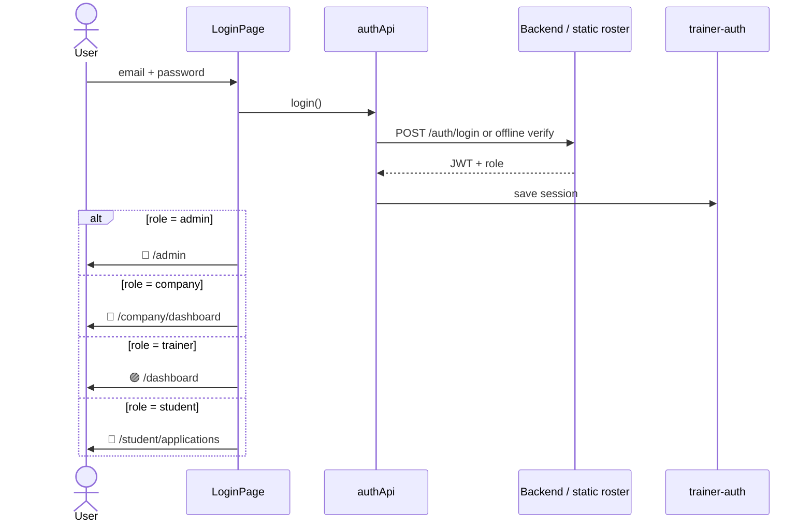

---

## 2. Register new member

| Role | Who acts | Result |
|------|----------|--------|
| **Guest** | Chooses role on `/register` | Row in `registered_members` |
| **Any role** | Logs in later | Redirected by chosen role |

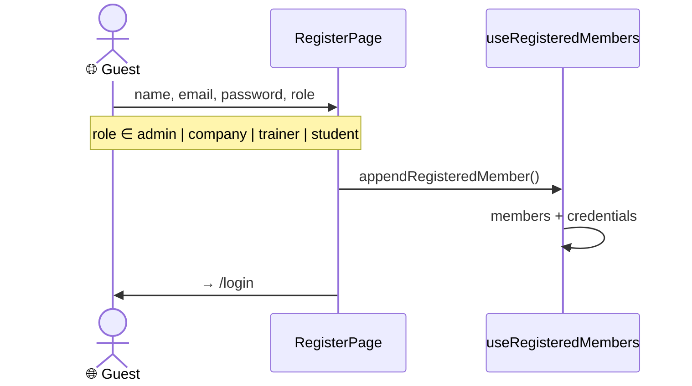

---

## 3. 🔷 Company adds a trainer

| # | Role | Action |
|---|------|--------|
| 1 | **Company** | Trainers → Add Trainer |
| 2 | **Company** | Sets fullName, email, linked tracks |
| 3 | **System** | Saves to `itconnect_company_trainers_v1` |
| 4 | **Company** (optional) | Creates portal account for trainer |
| 5 | **Trainer** | Logs in later → `/dashboard` (empty until assigned to a training) |

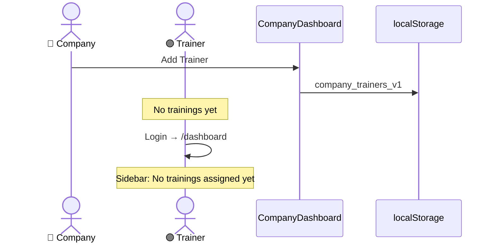

---

## 4. 🔷 Company → 🔶 Admin → Catalog → 🟣 Trainer

| # | Role | Action | Status |
|---|------|--------|--------|
| 1 | **Company** | Create training | `reviewStatus: PENDING` |
| 2 | **Trainer** | — (shown as pending) | Sidebar: Pending approval |
| 3 | **Admin** | Approve | `APPROVED` + `publishedTrainingId` |
| 4 | **Student** | — | Visible on `/services` |
| 5 | **Trainer** | — | Sidebar: Active |

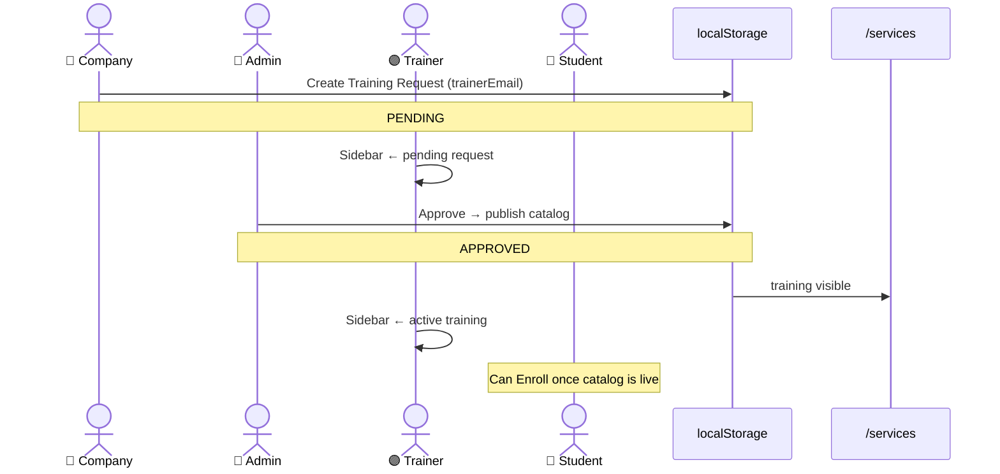

| After | Company | Admin | Trainer | Student |
|-------|---------|-------|---------|---------|
| Create | Sees PENDING | Sees in queue | Pending approval | — |
| Approve | APPROVED | In catalog | Active | Enroll available |
| Reject | REJECTED | — | Removed | — |

---

## 5. 🔶 Admin publishes training directly

| Role | Part in flow |
|------|--------------|
| **Admin** | Creates training from `/admin` → Trainings |
| **Student** | Sees it on `/services` (no company request) |
| **Trainer** | **Does not** see it unless `trainerEmail` is on a company request |

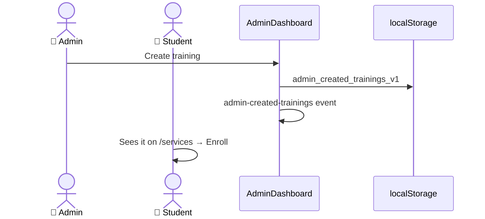

---

## 6. 🔷 Company → 🔶 Admin — custom track request

| # | Role | Action |
|---|------|--------|
| 1 | **Company** | Tracks → Request custom track |
| 2 | **Admin** | Approve → creates track in branch |
| 3 | **Company** | Uses track when creating a training |

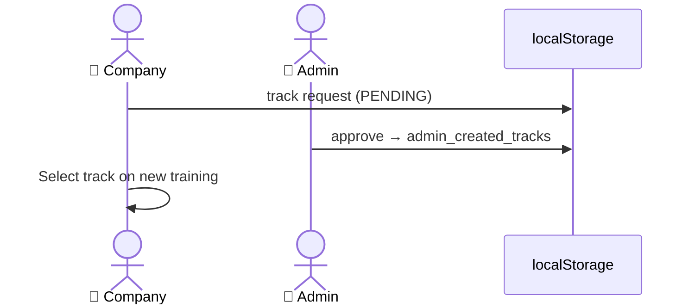

---

## 7. 🔵 Student enrolls in a training

| # | Role | Action | Page |
|---|------|--------|------|
| 0 | **Guest** | Enroll → redirect to login | `/login?redirect=...` |
| 1 | **Student** | Enroll (reserve seat) | `/services/training/...` |
| 2 | **Student** | Application + CV | `/student/enrollment/application` |
| 3 | **Trainer** | Sees pending | `/dashboard` → Accept new students |
| 4 | **Admin** | seatsTaken updates | `/admin` stats |

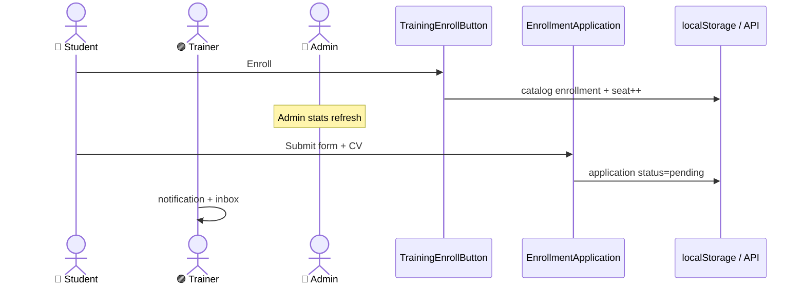

| Stage | Student sees | Trainer sees | Admin sees |
|-------|--------------|--------------|------------|
| After Enroll | Application form | — | Seat +1 |
| After Submit | status: pending | pending in inbox | — |
| After Approve | `/student/tasks` | enrolled list | — |

---

## 8. 🟣 Trainer approves enrollment application

| # | Role | Action | Student outcome |
|---|------|--------|-----------------|
| 1 | **Trainer** | Accept new students | — |
| 2 | **Trainer** | Approve | Workspace unlocked |
| 2b | **Trainer** | Reject | status: rejected + reason |

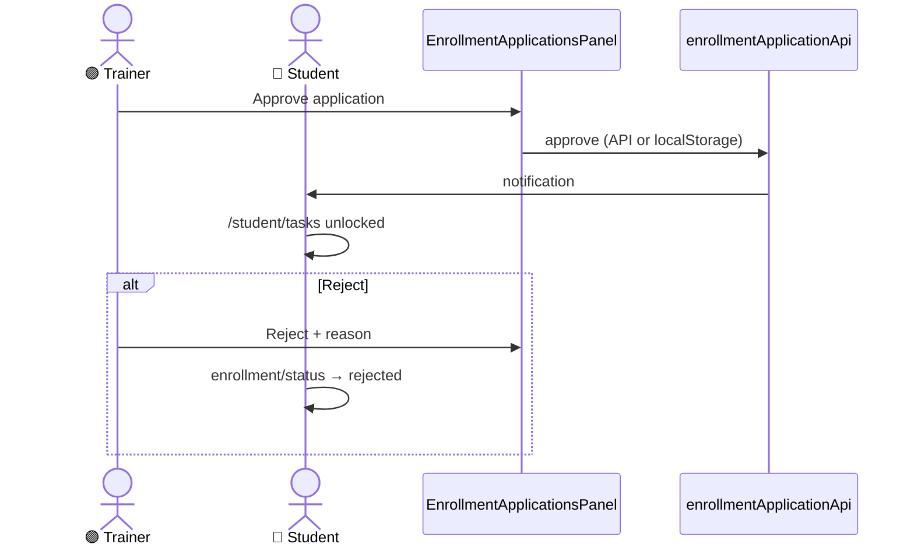

---

## 9. 🟣 Trainer sees trainings in workspace

| Role | Sees | Does not see |
|------|------|--------------|
| **Trainer** (on company roster) | Requests where `trainerEmail` = their email | Seed data, empty track placeholders |
| **Trainer** (not on company roster) | Demo `trainingSections` only | — |

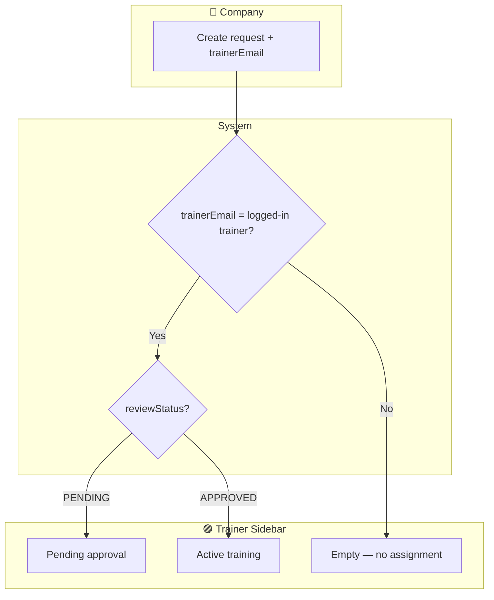

---

## 10. 🟣 Trainer creates task → 🔵 Student submits → evaluation

| # | Role | Action | Page |
|---|------|--------|------|
| 1 | **Trainer** | Create task brief | `/dashboard` → Create Task |
| 2 | **Trainer** | Assign to students | `/dashboard/section/:id` |
| 3 | **Student** | Submit work | `/student/submit` |
| 4 | **Trainer** | Review + grade | Task Submissions |
| 5 | **Student** | Read feedback | `/student/feedback` |

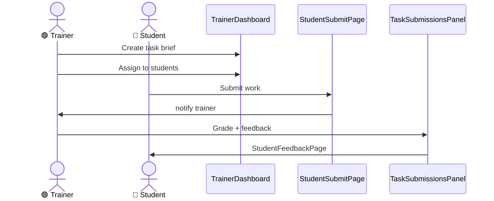

---

## 11. 🟣 Trainer publishes topic documentation

| # | Role | Action |
|---|------|--------|
| 1 | **Trainer** | Publishes topic for approved training |
| 2 | **Student** | Reads on `/student/topics` (after approval) |

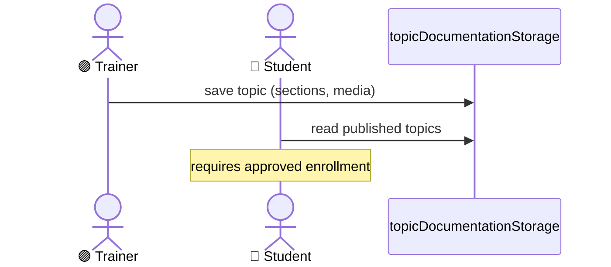

---

## 12. Messages between roles

Any logged-in role can message others:

| Sender | Receiver | Page |
|--------|----------|------|
| Student | Trainer / Admin / … | `/student/messages` or `/messages` |
| Trainer | Student / Company / … | `/messages` |
| Company | — | (Messages link removed from company header) |
| Admin | — | via members / direct |

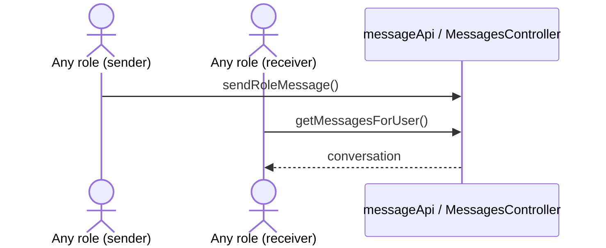

---

## 13. System custom events

| Event | Triggered by (role / component) | Affects |
|-------|----------------------------------|---------|
| `admin-created-trainings` | 🔶 Admin action | 🌐 Home, Services · 🔵 Student catalog |
| `company-training-requests` | 🔷 Company / 🔶 Admin | 🔶 Admin queue · 🟣 Trainer sidebar |
| `company-trainers-changed` | 🔷 Company | 🔶 Admin trainers tab |
| `ts-catalog-enrollment-changed` | 🔵 Student enroll | 🔶 Admin seats · Enroll button |
| `ts-enrollment-applications-changed` | 🔵 Student submit · 🟣 Trainer approve | 🟣 Inbox · 🔵 Student access |
| `registered-members-changed` | 🌐 Register / 🔶 Admin members | Auth for all roles |

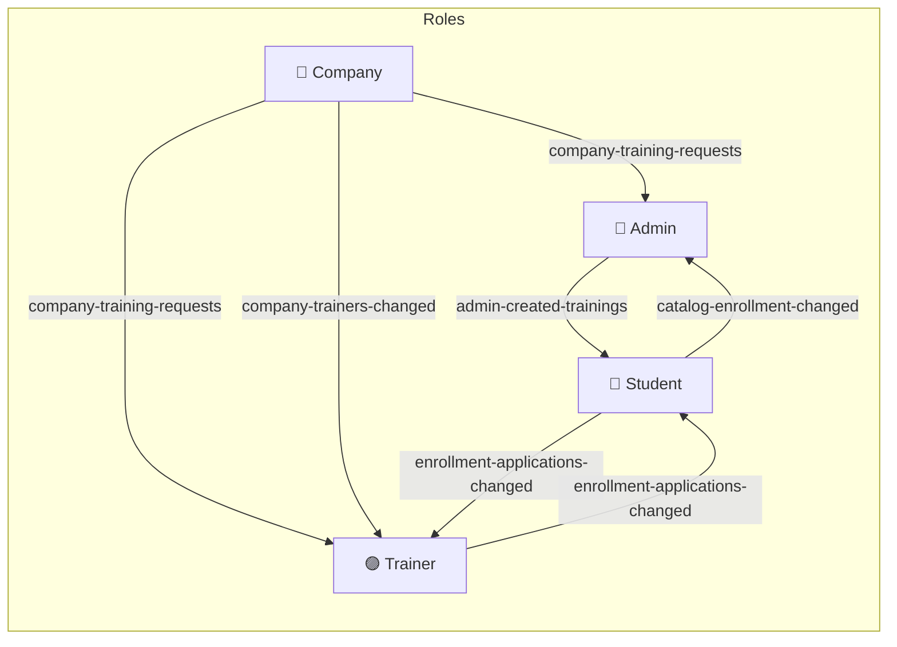

---

## Quick reference: role → storage

| Role | Main localStorage / backend keys |
|------|----------------------------------|
| **All roles** | `trainer-auth` |
| **Admin** | `admin_created_trainings`, `admin_created_tracks`, `trainer_track_assignments` |
| **Company** | `company_profiles`, `company_trainers`, `company_training_requests` |
| **Trainer** | Reads `company_training_requests` (filtered by email) |
| **Student** | `catalog-training-enrollments-{userId}`, `enrollment-applications` |
| **Shared backend** | `App_Data/enrollment-applications.json`, Messages, Tasks API |

---

## Quick summary by role

```
🔷 Company:  trainer → training request → (waits for Admin)
🔶 Admin:    approve → catalog
🟣 Trainer:  sees training → accepts students → tasks → evaluation
🔵 Student:  Enroll → Application → Tasks → Submit → Feedback
```
