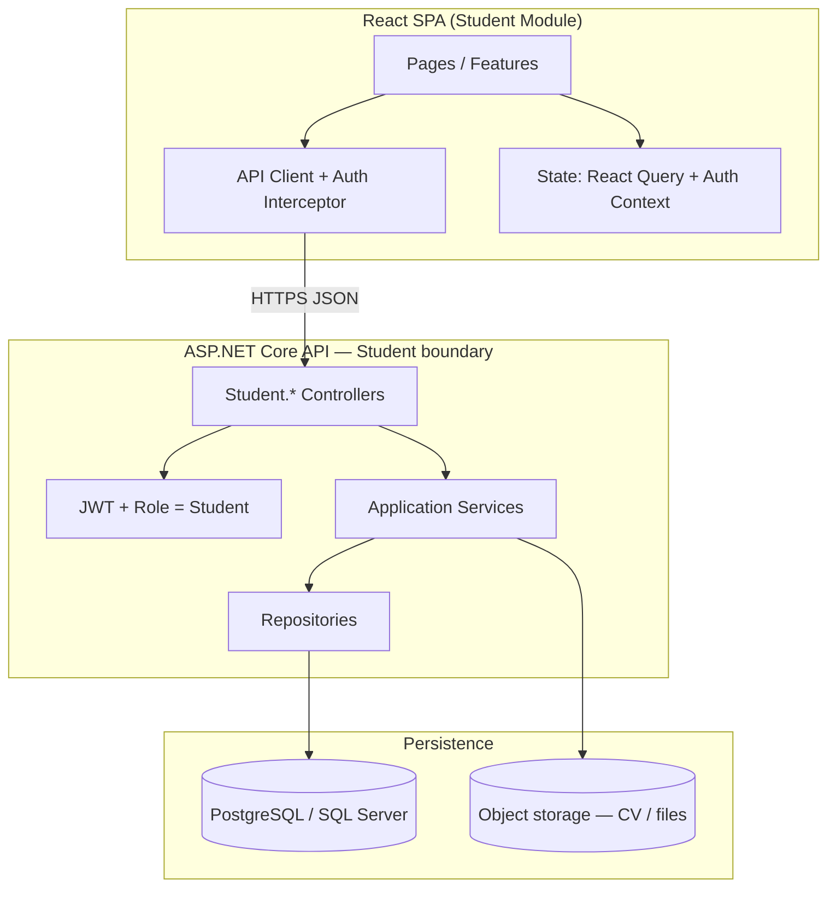
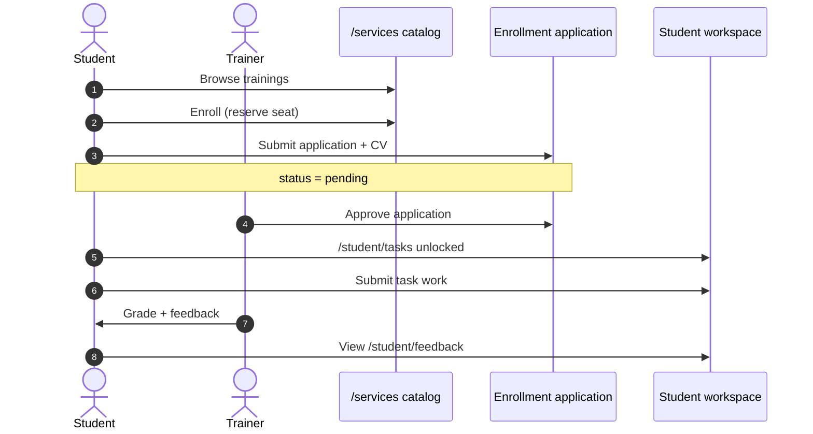
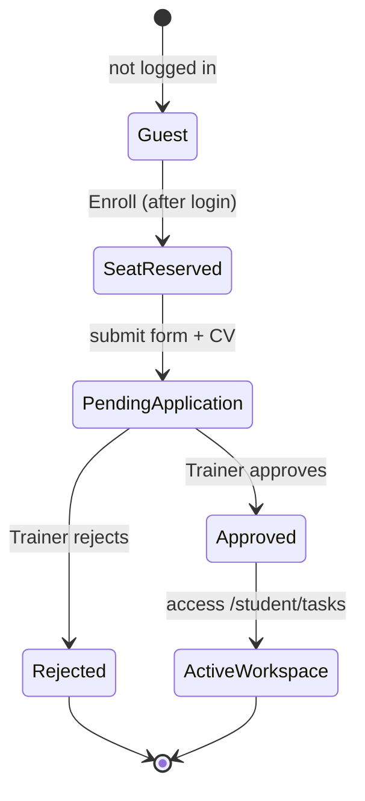
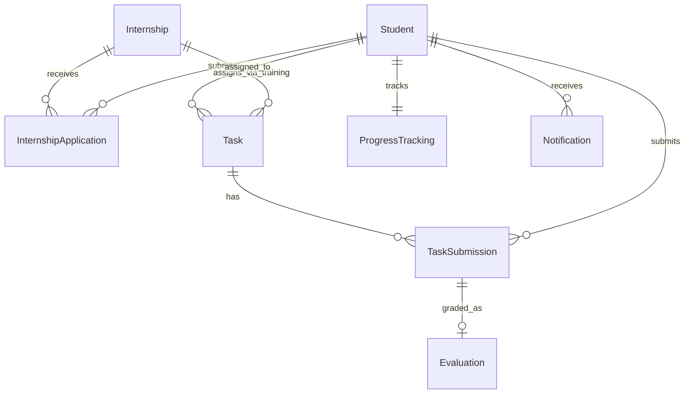

# Student (Trainee) Module — Architecture & Implementation Guide

Production-ready design for the **Student role only** in Training Sphere (internship/training management).

> **Platform-wide event flows (all roles):** [../EVENT_FLOWS.md](../EVENT_FLOWS.md) — login, company → admin → catalog, enrollment, tasks, and “who does what” tables (English).

---

## 1. System architecture

### 1.1 High-level flow



### 1.2 Request lifecycle

1. **Student** opens SPA → `AuthProvider` reads JWT from memory + refresh strategy.
2. **Route guard** (`StudentOnlyRoute`) checks `role === Student` before rendering `/student/*`.
3. **API client** attaches `Authorization: Bearer <token>` on every call.
4. **Controller** validates JWT, enforces `[Authorize(Roles = "Student")]`, binds DTO, runs FluentValidation.
5. **Service** applies business rules (deadlines, one application per program, submission versioning).
6. **Repository** reads/writes entities; returns domain results mapped to DTOs.
7. **Response** → UI updates cache (React Query) + optional notification.

### 1.3 Student event flows (current app)

How the **Student** role moves through the live demo — tied to other roles. Full cross-role diagrams: [EVENT_FLOWS.md](../EVENT_FLOWS.md).

#### End-to-end (Student perspective)



#### Step-by-step

| Step | Student action | Route | Depends on | Outcome |
|------|----------------|-------|------------|---------|
| 1 | Browse catalog | `/services`, `/student/internships` | Admin/Company published training | Sees available programs |
| 2 | Enroll | `/services/training/:branchId/:trainingId` | Free seat | Seat reserved → application form |
| 3 | Submit application | `/student/enrollment/application` | Logged in as student | `status: pending` |
| 4 | Check status | `/student/enrollment/status` | — | pending / approved / rejected |
| 5 | Open workspace | `/student/tasks` | Trainer approved | Tasks, topics, submit |
| 6 | Submit work | `/student/submit` | Assigned task | Trainer notified |
| 7 | Read feedback | `/student/feedback` | Trainer evaluated | Grades & comments |

#### Enrollment state machine (Student)



**Storage (demo):** `ts-catalog-training-enrollments-{userId}`, `ts-enrollment-applications-v1` or `App_Data/enrollment-applications.json` via API.

### 1.4 Module boundaries (ignore Trainer/Admin)

| Concern | Owned by Student module |
|--------|-------------------------|
| Auth (register/login/logout) | Yes — student accounts only |
| Browse/apply internships | Yes — read programs, write applications |
| Tasks & submissions | Yes — read assigned tasks, create submissions |
| Feedback & grades | Yes — read-only for own records |
| Progress | Yes — aggregated view for current student |
| Profile | Yes — own profile CRUD |
| Company/trainer workflows | **No** — consume read models only |

### 1.5 Integration points (read-only from other domains)

- **Internship catalog** — published programs (`Internship` where `Status = Published`).
- **Task assignment** — tasks where `AssignedStudentId = current student` (created by trainer system).
- **Evaluation** — evaluations linked to `TaskSubmission` (written by trainer system, read by student).

---

## 2. Database design

### 2.1 ER overview



### 2.2 Tables

#### `Students`

| Column | Type | Notes |
|--------|------|--------|
| `Id` | UUID PK | |
| `Email` | VARCHAR(320) UNIQUE NOT NULL | login |
| `PasswordHash` | VARCHAR(500) NOT NULL | |
| `FullName` | VARCHAR(200) NOT NULL | |
| `Phone` | VARCHAR(50) NULL | |
| `University` | VARCHAR(200) NULL | |
| `Specialization` | VARCHAR(120) NULL | |
| `Bio` | TEXT NULL | |
| `AvatarUrl` | VARCHAR(500) NULL | |
| `GithubUsername` | VARCHAR(100) NULL | |
| `PreferredGithubRepoUrl` | VARCHAR(500) NULL | |
| `IsActive` | BIT NOT NULL DEFAULT 1 | |
| `CreatedAtUtc` | TIMESTAMPTZ NOT NULL | |
| `UpdatedAtUtc` | TIMESTAMPTZ NOT NULL | |

#### `Internships`

| Column | Type | Notes |
|--------|------|--------|
| `Id` | UUID PK | |
| `Title` | VARCHAR(300) NOT NULL | |
| `CompanyName` | VARCHAR(200) NOT NULL | |
| `Specialization` | VARCHAR(120) | |
| `TrainingType` | VARCHAR(80) | Internship / Traineeship |
| `Summary` | TEXT | |
| `Description` | TEXT | |
| `Location` | VARCHAR(200) NULL | |
| `SeatsTotal` | INT | |
| `SeatsFilled` | INT DEFAULT 0 | |
| `OpensOnUtc` | TIMESTAMPTZ | |
| `ClosesOnUtc` | TIMESTAMPTZ | |
| `Status` | VARCHAR(30) | Draft / Published / Closed |
| `CreatedAtUtc` | TIMESTAMPTZ | |

#### `InternshipApplications`

| Column | Type | Notes |
|--------|------|--------|
| `Id` | UUID PK | |
| `StudentId` | UUID FK → Students | |
| `InternshipId` | UUID FK → Internships | |
| `Status` | VARCHAR(30) | Pending / UnderReview / Accepted / Rejected / Withdrawn |
| `CoverLetter` | TEXT NULL | |
| `CvFileName` | VARCHAR(260) NULL | |
| `CvStorageKey` | VARCHAR(500) NULL | blob key |
| `SubmittedAtUtc` | TIMESTAMPTZ | |
| `ReviewedAtUtc` | TIMESTAMPTZ NULL | |
| `RejectionReason` | VARCHAR(500) NULL | |

**Unique:** `(StudentId, InternshipId)` — one application per program.

#### `Tasks`

| Column | Type | Notes |
|--------|------|--------|
| `Id` | UUID PK | |
| `InternshipId` | UUID FK NULL | optional program scope |
| `TrainingSessionId` | UUID NULL | cohort/session |
| `AssignedStudentId` | UUID FK → Students | |
| `Title` | VARCHAR(300) NOT NULL | |
| `Description` | TEXT | |
| `DeadlineUtc` | TIMESTAMPTZ | |
| `Status` | VARCHAR(30) | Assigned / Closed |
| `CreatedAtUtc` | TIMESTAMPTZ | |

#### `TaskSubmissions`

| Column | Type | Notes |
|--------|------|--------|
| `Id` | UUID PK | |
| `TaskId` | UUID FK → Tasks | |
| `StudentId` | UUID FK → Students | |
| `Version` | INT DEFAULT 1 | resubmissions increment |
| `SubmissionType` | VARCHAR(20) | File / Link / Github |
| `SubmissionLink` | VARCHAR(500) NULL | |
| `FileName` | VARCHAR(260) NULL | |
| `FileStorageKey` | VARCHAR(500) NULL | |
| `GithubRepoUrl` | VARCHAR(500) NULL | |
| `Notes` | TEXT NULL | |
| `Status` | VARCHAR(30) | Submitted / PendingReview / Returned / Accepted |
| `SubmittedAtUtc` | TIMESTAMPTZ | |

**Unique (active):** `(TaskId, StudentId, Version)` or latest-only policy via partial index.

#### `Evaluations`

| Column | Type | Notes |
|--------|------|--------|
| `Id` | UUID PK | |
| `TaskSubmissionId` | UUID FK UNIQUE → TaskSubmissions | one evaluation per submission |
| `TrainerId` | UUID | external FK (not student-owned) |
| `Grade` | VARCHAR(10) | A–F or numeric |
| `Feedback` | TEXT | |
| `EvaluatedAtUtc` | TIMESTAMPTZ | |

#### `ProgressTracking`

| Column | Type | Notes |
|--------|------|--------|
| `Id` | UUID PK | |
| `StudentId` | UUID FK UNIQUE → Students | one row per student |
| `CompletionPercent` | INT DEFAULT 0 | |
| `AttendancePercent` | INT DEFAULT 0 | |
| `PerformanceScore` | DECIMAL(4,2) | |
| `CompletedTasksCount` | INT | denormalized cache |
| `PendingTasksCount` | INT | |
| `LastActivityAtUtc` | TIMESTAMPTZ | |
| `WeeklyActivityJson` | JSONB | `[{label, units}]` |

#### `Notifications` (optional)

| Column | Type | Notes |
|--------|------|--------|
| `Id` | UUID PK | |
| `StudentId` | UUID FK | |
| `Type` | VARCHAR(50) | ApplicationAccepted, GradePosted, … |
| `Title` | VARCHAR(200) | |
| `Body` | TEXT | |
| `IsRead` | BIT | |
| `CreatedAtUtc` | TIMESTAMPTZ | |

See `database/schema.sql` for executable DDL.

---

## 3. Backend structure

### 3.1 Layer responsibilities

| Layer | Responsibility |
|-------|----------------|
| **Api** | HTTP, auth attributes, model binding, status codes, no business logic |
| **Application** | Use cases, DTOs, validators, orchestration, authorization checks (`studentId == current user`) |
| **Domain** | Entities, enums, domain rules (deadline passed, application state machine) |
| **Infrastructure** | EF Core, repositories, file storage, GitHub URL validator, email (future) |

### 3.2 Controllers (Student.Api)

| Controller | Responsibility |
|------------|----------------|
| `StudentAuthController` | Register, login, refresh, logout (token blacklist optional) |
| `StudentProfileController` | Get/update profile, avatar |
| `StudentInternshipsController` | List/filter programs, get details |
| `StudentApplicationsController` | Apply, list mine, get status/timeline |
| `StudentTasksController` | List assigned tasks, get detail |
| `StudentSubmissionsController` | Submit task (file/link), list my submissions |
| `StudentGithubController` | Validate & save preferred repo URL |
| `StudentFeedbackController` | List evaluations for student |
| `StudentProgressController` | Dashboard stats + progress summary |
| `StudentNotificationsController` | List/mark read (optional) |

### 3.3 Services (Application)

| Service | Responsibility |
|---------|----------------|
| `IStudentAuthService` | Register, verify credentials, issue JWT |
| `IStudentProfileService` | Profile CRUD |
| `IInternshipBrowseService` | Published catalog, filters |
| `IApplicationService` | Apply, status, timeline builder |
| `ITaskQueryService` | Assigned tasks for student |
| `ISubmissionService` | Create submission, enforce deadline, versioning |
| `IGithubLinkService` | Validate URL, persist on student/submission |
| `IFeedbackQueryService` | Map evaluations → DTOs |
| `IProgressService` | Recompute/cache progress, weekly activity |
| `INotificationService` | Create/read notifications |

### 3.4 Repositories (Infrastructure)

| Repository | Responsibility |
|------------|----------------|
| `IStudentRepository` | Student by id/email |
| `IInternshipRepository` | Published internships, by id |
| `IApplicationRepository` | CRUD applications, duplicate check |
| `ITaskRepository` | Tasks by student id |
| `ISubmissionRepository` | Submissions by task/student |
| `IEvaluationRepository` | By student via submission join |
| `IProgressRepository` | Upsert progress row |
| `INotificationRepository` | Student notifications |

### 3.5 DTOs & validation (examples)

- `RegisterStudentRequest` — Email, Password, FullName (required); FluentValidation min password length.
- `SubmitTaskRequest` — TaskId, optional Link/File/Github; custom rule: at least one delivery method.
- `ApplyInternshipRequest` — InternshipId, CoverLetter, CvFileName.

---

## 4. REST API endpoints

Base path: `/api/student/v1`  
Auth: `Authorization: Bearer <jwt>` except register/login.

### 4.1 Auth

**POST** `/auth/register`

```json
// Request
{
  "email": "sara@university.edu",
  "password": "SecurePass123!",
  "fullName": "Sara Ahmed",
  "university": "Cairo University",
  "specialization": "Frontend"
}

// Response 201
{
  "studentId": "a1b2c3d4-...",
  "email": "sara@university.edu",
  "fullName": "Sara Ahmed",
  "accessToken": "eyJhbG...",
  "expiresIn": 3600
}
```

**POST** `/auth/login`

```json
// Request
{ "email": "sara@university.edu", "password": "SecurePass123!" }

// Response 200
{
  "studentId": "a1b2c3d4-...",
  "role": "Student",
  "accessToken": "eyJhbG...",
  "expiresIn": 3600
}
```

**POST** `/auth/logout` → 204 (client discards token; optional server refresh denylist)

### 4.2 Profile

**GET** `/profile` → 200 student profile  
**PATCH** `/profile`

```json
{
  "fullName": "Sara Ahmed",
  "phone": "+20...",
  "bio": "React enthusiast",
  "githubUsername": "sara-dev"
}
```

### 4.3 Internships

**GET** `/internships?specialization=Frontend&company=Fabrikam` → list of published programs  
**GET** `/internships/{id}` → detail

### 4.4 Applications

**POST** `/applications`

```json
{
  "internshipId": "prog-fe-03",
  "coverLetter": "I am excited to apply...",
  "cvFileName": "sara-cv.pdf"
}
```

**GET** `/applications` → all for current student  
**GET** `/applications/{id}` → status + timeline

```json
{
  "id": "app-...",
  "internshipTitle": "Product engineering trainee",
  "status": "Pending",
  "timeline": [
    { "label": "Application received", "state": "Complete", "atUtc": "2026-05-01T10:00:00Z" },
    { "label": "Recruiter screen", "state": "Upcoming", "atUtc": "2026-05-03T10:00:00Z" }
  ]
}
```

### 4.5 Tasks & submissions

**GET** `/tasks` → assigned tasks with submission status  
**GET** `/tasks/{id}`

**POST** `/tasks/{taskId}/submissions` (multipart or JSON)

```json
{
  "submissionLink": "https://drive.google.com/...",
  "fileName": "deliverable.zip",
  "notes": "Includes README",
  "githubRepoUrl": null
}
```

**GET** `/submissions` → history for current student

### 4.6 GitHub

**POST** `/github/validate`

```json
{ "repositoryUrl": "https://github.com/sara-dev/internship-project" }
```

```json
{
  "isValid": true,
  "normalizedUrl": "https://github.com/sara-dev/internship-project",
  "message": "Repository is reachable."
}
```

**PUT** `/profile/github-repo` — persist preferred repo on student profile

### 4.7 Feedback & progress

**GET** `/feedback` → list of evaluations  
**GET** `/dashboard/stats`

```json
{
  "activeInternships": 1,
  "completedTasks": 4,
  "pendingTasks": 2,
  "feedbackReceived": 3
}
```

**GET** `/progress`

```json
{
  "completionPercent": 67,
  "attendancePercent": 82,
  "performanceScore": 8.2,
  "weeklyActivity": [
    { "label": "Mon", "units": 4 },
    { "label": "Tue", "units": 6 }
  ]
}
```

---

## 5. Frontend structure

### 5.1 Pages

| Route | Page | Purpose |
|-------|------|---------|
| `/student/home` | Dashboard | Stats, activity, celebrate, shortcuts |
| `/student/internships` | Browse | Catalog + filters |
| `/student/internships/:id` | Details | Program detail + Apply CTA |
| `/student/applications` | My Applications | Status buckets + timeline |
| `/student/apply` | Apply (wizard) | Form + CV upload |
| `/student/tasks` | Tasks | Assigned list |
| `/student/submit` | Submit | Pick task, file/link/GitHub |
| `/student/github` | GitHub | Link repo |
| `/student/feedback` | Grades & Feedback | Evaluation cards |
| `/student/progress` | Progress | Charts + bars |
| `/student/profile` | Profile Settings | Edit profile |

### 5.2 Component hierarchy (example)

```
StudentDashboardLayout
├── StudentSidebar / MobileNav
├── ToastHost
└── Outlet
    ├── DashboardPage
    │   ├── WelcomeHeader
    │   ├── StatsGrid
    │   ├── ActivityFeed
    │   └── CelebrateStrip
    ├── InternshipsBrowsePage
    │   ├── InternshipFilters
    │   └── InternshipCardGrid
    ├── InternshipDetailPage
    ├── ApplicationsPage
    │   └── ApplicationTimelineCard
    ├── TasksPage
    │   └── TaskListItem
    ├── SubmitTaskPage
    │   └── SubmissionForm (file | link | github)
    ├── FeedbackPage
    ├── ProgressPage
    └── ProfileSettingsPage
```

### 5.3 State management

| Concern | Approach |
|---------|----------|
| Auth (token, student, role) | `AuthContext` + `localStorage` refresh |
| Server data | **TanStack Query** — keys: `['student','tasks']`, `['student','applications']` |
| Forms | React Hook Form + Zod schemas mirroring API DTOs |
| Optimistic UI | Submissions/applications on mutate + rollback on error |
| Notifications | Layout-level toast + optional `['student','notifications']` query |

---

## 6. Authentication & authorization (Student RBAC)

### 6.1 JWT claims

```json
{
  "sub": "<studentId>",
  "email": "sara@university.edu",
  "role": "Student",
  "name": "Sara Ahmed"
}
```

### 6.2 Backend

```csharp
[Authorize(Roles = "Student")]
[Route("api/student/v1/[controller]")]
public class StudentTasksController : ControllerBase
{
    private Guid CurrentStudentId =>
        Guid.Parse(User.FindFirstValue(ClaimTypes.NameIdentifier)!);

    // Every query filters by CurrentStudentId
}
```

Policy: **resource ownership** — `application.StudentId == CurrentStudentId` or 404 (not 403, to avoid leaking ids).

### 6.3 Frontend

```jsx
// StudentOnlyRoute.jsx
if (role !== 'student') return <Navigate to="/login" state={{ from }} replace />;
return <Outlet context={{ studentId, token }} />;
```

API client: 401 → clear auth → redirect login; 403 → error toast.

---

## 7. Folder structure

### 7.1 Backend (in-repo scaffold: `backend/Student/`)

```
backend/Student/
├── Domain/
│   ├── Entities/          # Student, Internship, Task, ...
│   └── Enums/             # ApplicationStatus, SubmissionStatus
├── Application/
│   ├── Contracts/         # IStudentAuthService, I*Repository
│   ├── Dtos/              # Request/response records
│   ├── Services/          # Use case implementations
│   └── Validators/        # FluentValidation
├── Infrastructure/
│   ├── Persistence/       # DbContext, configurations
│   └── Repositories/      # EF implementations
└── Api/
    └── Controllers/       # Thin controllers
```

### 7.2 Frontend (`frontend/src/modules/student/`)

```
modules/student/
├── api/                   # typed client per resource
├── features/
│   ├── auth/
│   ├── dashboard/
│   ├── internships/
│   ├── applications/
│   ├── tasks/
│   ├── submissions/
│   ├── feedback/
│   ├── progress/
│   └── profile/
├── components/            # shared UI (StatusBadge, Timeline, ...)
├── hooks/
├── routes.jsx
└── index.js
```

### 7.3 Docs

```
docs/student-module/
├── STUDENT_MODULE.md      # this file
└── database/
    └── schema.sql
```

---

## 8. Flow explanations

### 8.1 Student applies for internship

1. Student opens **Browse Internships** → `GET /internships` (published only).
2. Opens detail → `GET /internships/{id}`.
3. Clicks **Apply** → form with cover letter + CV.
4. `POST /applications` with `internshipId`.
5. Service checks: program open, seats available, no duplicate `(student, internship)`.
6. Repository inserts `InternshipApplication` status `Pending`, builds timeline steps.
7. Notification row created (optional).
8. UI shows success → redirects to **My Applications** with Pending tab.

### 8.2 Student submits task

1. **Tasks** page → `GET /tasks` shows deadline + status.
2. **Submit** page selects task → validates deadline not passed.
3. Student provides link and/or file and/or GitHub URL.
4. `POST /tasks/{id}/submissions` — file uploaded to blob, metadata in `TaskSubmissions`.
5. Service sets submission `Submitted`, increments version if resubmit.
6. Progress service updates `PendingTasksCount` / `LastActivityAtUtc`.
7. Trainer domain (out of scope) later picks up for review.
8. UI toast + activity feed entry + invalidate `['student','tasks']` query.

### 8.3 Student checks feedback

1. **Grades & Feedback** → `GET /feedback` joins `Evaluations` → `TaskSubmissions` → `Tasks`.
2. Cards show grade, trainer comment, task title, date.
3. Dashboard `GET /dashboard/stats` increments `feedbackReceived`.
4. Celebrate milestone on home when new grade arrives (compare `evaluatedAt` vs last seen).

---

## Migration from current codebase

| Current | Target |
|---------|--------|
| `frontend/src/pages/student/*` | `frontend/src/modules/student/features/*` |
| `frontend/src/api/studentPortalApi.js` | `modules/student/api/*.ts` split by resource |
| `backend/Controllers/*` mixed roles | `backend/Student/Api/*` student-only |
| In-memory / localStorage fallbacks | EF Core + real DB; keep offline flag for demos only |

Implement in phases: **schema → repositories → v1 API → React module shell → page migration**.
